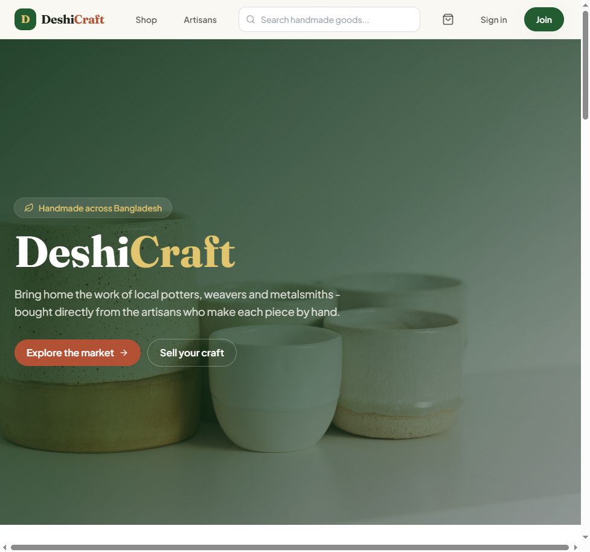
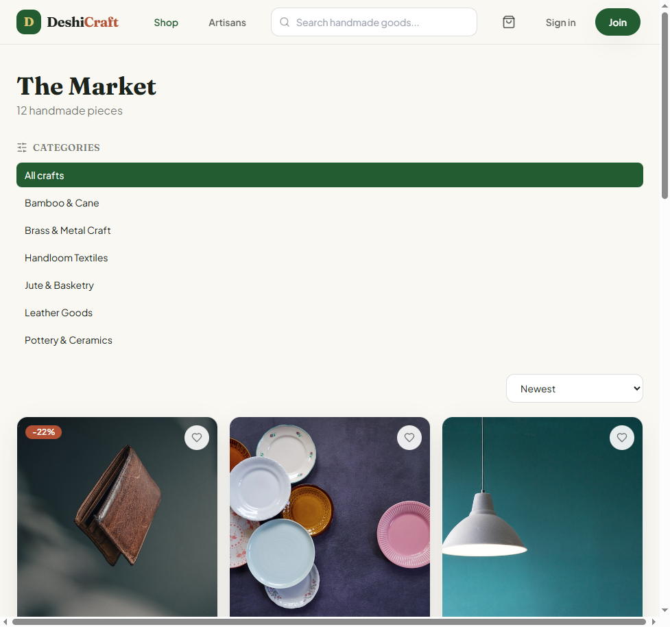
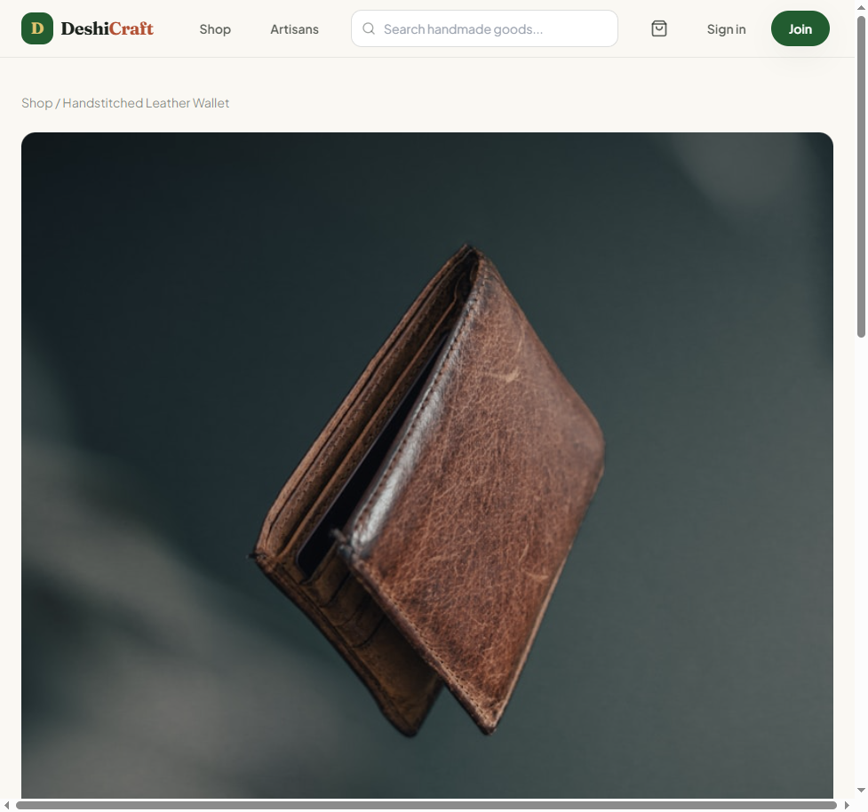
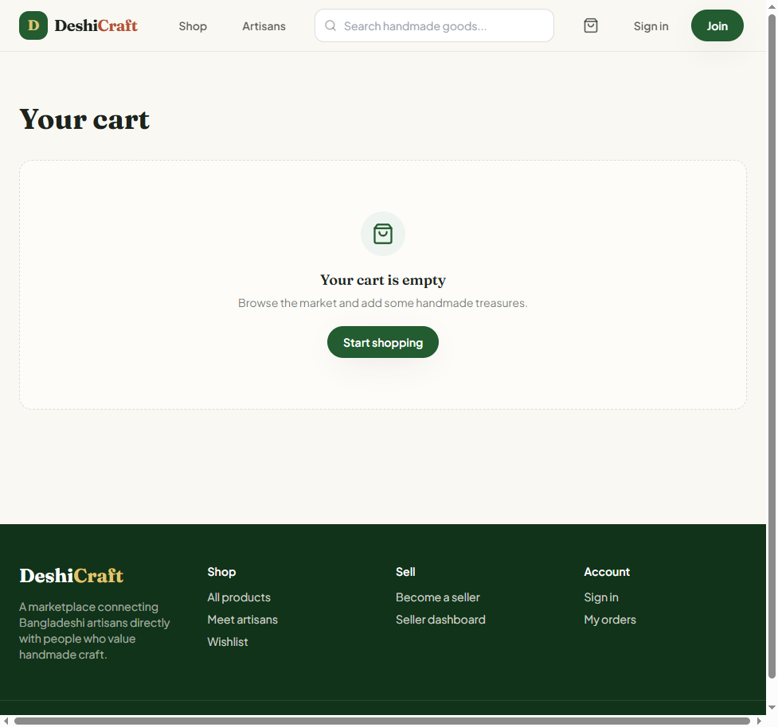
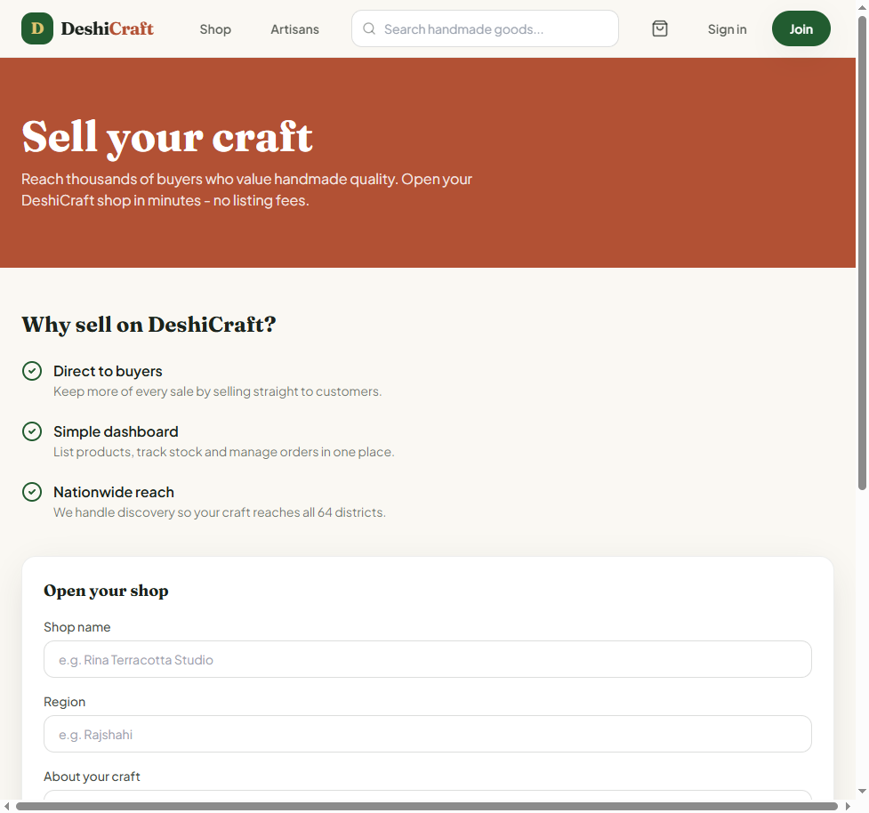
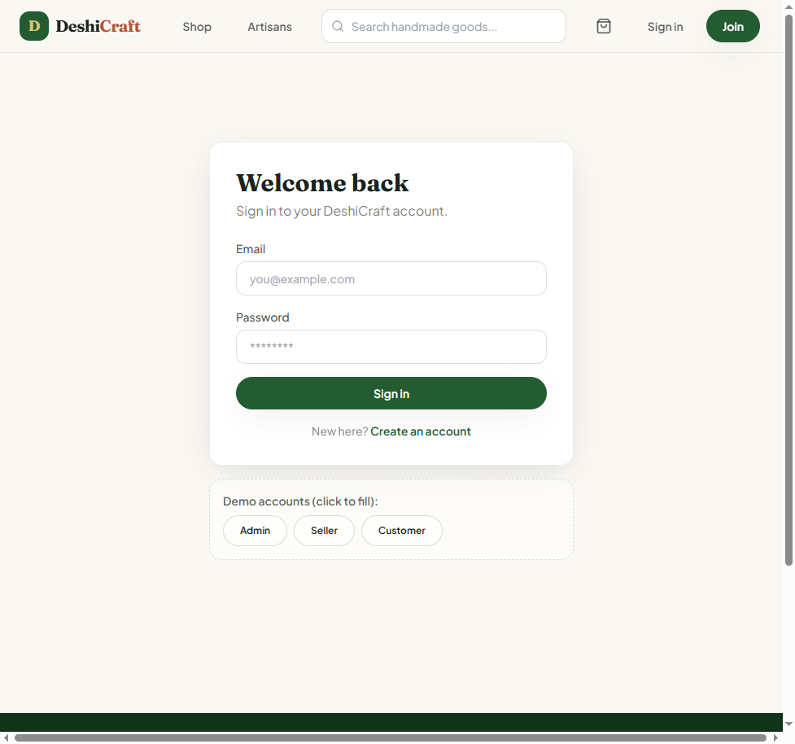

# DeshiCraft - Bangladesh Artisan Marketplace

A full-stack, multi-vendor e-commerce platform where local Bangladeshi artisans sell handmade
crafts directly to buyers. Built on the **MERN stack with TypeScript** (MongoDB, Express, React,
Node) as a production-shaped portfolio project.

> Customers browse and buy handmade goods, sellers manage their own shop and orders, and admins
> oversee the whole marketplace - all with JWT auth, role-based access, a full order lifecycle,
> and a polished storefront.


**Live demo:** [https://deshicraft.vercel.app](https://deshicraft.vercel.app)  
**API:** [https://deshicraft-api.onrender.com/api/health](https://deshicraft-api.onrender.com/api/health)

Stack: React on **Vercel** · Express API on **Render** · **MongoDB Atlas** · see [deployment guide](docs/deployment.md).

---

## Features

### Storefront (customers)
- Browse a catalog with **search, category filters, sorting, and pagination**
- Product detail pages with image gallery, seller info, and **verified-purchase reviews**
- **Cart** (persisted locally) and server-synced **wishlist**
- **Checkout** with saved addresses, Cash on Delivery, and a card (sandbox) option
- Order tracking with a visual **status timeline** and self-service cancellation

### Seller dashboard
- Apply to open a shop (own profile, region, bio)
- Full **product CRUD** with stock, pricing, tags, and multiple images
- Incoming orders with a guarded **status pipeline** (pending -> confirmed -> shipped -> delivered)
- Overview stats: revenue, units sold, order status breakdown, low-stock alerts

### Admin panel
- Marketplace KPIs and a 7-day orders chart
- **Seller verification** (approve / revoke)
- Category management (create / delete with safety checks)
- Global paginated users and orders with filters

### Engineering
- **JWT access + refresh tokens** (refresh via httpOnly cookie, silent refresh on the client)
- **Role-based authorization** (customer / seller / admin) enforced by middleware
- Zod request validation, centralized error handling, Helmet, CORS, and rate limiting
- **Atomic stock decrement** via MongoDB transactions (with a standalone-Mongo fallback)
- End-to-end **API smoke tests** using an in-memory MongoDB + the Node.js test runner
- **GitHub Actions CI**: typecheck, build, and test on every push and PR

---

## Tech stack

| Layer      | Technology |
|------------|------------|
| Frontend   | React 18, TypeScript, Vite, Tailwind CSS, React Router, TanStack Query, Zustand |
| Backend    | Node.js, Express, TypeScript, Mongoose |
| Database   | MongoDB |
| Auth       | JWT (access + refresh), bcrypt |
| Validation | Zod |
| Testing    | Node test runner, mongodb-memory-server |
| Tooling    | Docker Compose, GitHub Actions |

---

## Screenshots

| Home | Shop |
|------|------|
|  |  |

| Product detail | Cart |
|----------------|------|
|  |  |

| Sell your craft | Sign in |
|-----------------|---------|
|  |  |

_Tip: sign in as admin (`admin@deshicraft.local`) to explore seller and admin dashboards._

---

## Quick start

### Prerequisites
- Node.js 20+
- Docker Desktop (for local MongoDB) **or** a MongoDB Atlas connection string

### 1. Clone and install
```bash
git clone https://github.com/NazmusSakib3/deshicraft.git
cd deshicraft
npm install            # installs both workspaces (server + client)
```

### 2. Start MongoDB
```bash
docker compose up -d   # starts MongoDB on :27017 and mongo-express on :8081
```
No Docker? Set `MONGO_URI` in `server/.env` to your Atlas connection string instead.

### 3. Configure environment
```bash
cp server/.env.example server/.env
cp client/.env.example client/.env
```

### 4. Seed demo data
```bash
npm run seed --workspace server
```
This creates categories, artisans, products, and demo accounts:

| Role     | Email                       | Password      |
|----------|-----------------------------|---------------|
| Admin    | admin@deshicraft.local      | Admin123!     |
| Seller   | rina@deshicraft.local       | Seller123!    |
| Customer | customer@deshicraft.local   | Customer123!  |

### 5. Run the app
```bash
npm run dev            # runs API (:5000) and client (:5173) together
```
Open http://localhost:5173. The Vite dev server proxies `/api` to the backend.

---

## Testing

```bash
npm test --workspace server
```
Spins up an in-memory MongoDB and exercises the full flow: seed -> login -> create product ->
place order -> stock decrement -> order status transition -> admin stats -> RBAC checks.

---

## Project structure

```text
deshicraft/
├── server/                     # Express + Mongoose API (TypeScript)
│   ├── src/
│   │   ├── config/             # env + db connection
│   │   ├── models/             # User, Category, Product, Review, Order
│   │   ├── middleware/         # auth, validation, error handling
│   │   ├── controllers/        # route handlers
│   │   ├── routes/             # API v1 routes
│   │   ├── validation/         # Zod schemas
│   │   ├── seed/               # database seeding
│   │   └── test/               # API smoke tests
│   └── Dockerfile
├── client/                     # React + Vite + Tailwind (TypeScript)
│   └── src/
│       ├── components/         # shared UI
│       ├── pages/              # storefront, seller/, admin/
│       ├── store/              # Zustand stores (auth, cart, wishlist)
│       └── lib/                # axios client, formatters
├── docker-compose.yml          # MongoDB + mongo-express
├── render.yaml                 # API deploy blueprint
└── .github/workflows/ci.yml    # CI pipeline
```

---

## Deployment

The frontend deploys to **Vercel** and the API to **Render** (or any Node host), with the database
on **MongoDB Atlas**. See [docs/deployment.md](docs/deployment.md) for the full checklist.

Quick version:
1. Create a free MongoDB Atlas cluster and copy the connection string (see [docs/deployment.md](docs/deployment.md)).
2. Deploy the API on Render using `render.yaml` (monorepo install from repo root; set `MONGO_URI`, `CLIENT_URL`, seed vars).
3. Deploy `client/` to Vercel with `VITE_API_URL` pointing at the API (`.../api`).
4. Set `CLIENT_URL` on Render to your Vercel origin, redeploy, then seed production once.

---

## API overview

Base path: `/api`

| Area       | Endpoints |
|------------|-----------|
| Auth       | `POST /auth/register`, `POST /auth/login`, `POST /auth/refresh`, `POST /auth/logout`, `GET /auth/me` |
| Products   | `GET /products`, `GET /products/:slug`, `POST /products`, `PATCH /products/:id`, `DELETE /products/:id`, `GET /products/mine` |
| Reviews    | `GET /products/:slug/reviews`, `POST /products/:slug/reviews`, `DELETE /reviews/:id` |
| Categories | `GET /categories`, `POST /categories`, `PATCH /categories/:id`, `DELETE /categories/:id` |
| Cart/Wish  | `GET /users/wishlist`, `POST /users/wishlist/:productId`, addresses under `/users/addresses` |
| Orders     | `POST /orders`, `GET /orders/mine`, `GET /orders/:id`, `POST /orders/:id/cancel`, `GET /orders/seller`, `PATCH /orders/:id/status` |
| Seller     | `POST /seller/apply`, `GET /seller/dashboard` |
| Uploads    | `POST /uploads` (seller/admin — product image to Cloudinary) |
| Admin      | `GET /admin/stats`, `GET /admin/users`, `GET /admin/sellers`, `PATCH /admin/sellers/:id/approve`, `GET /admin/orders` |

---

## License

MIT - see [LICENSE](LICENSE).
